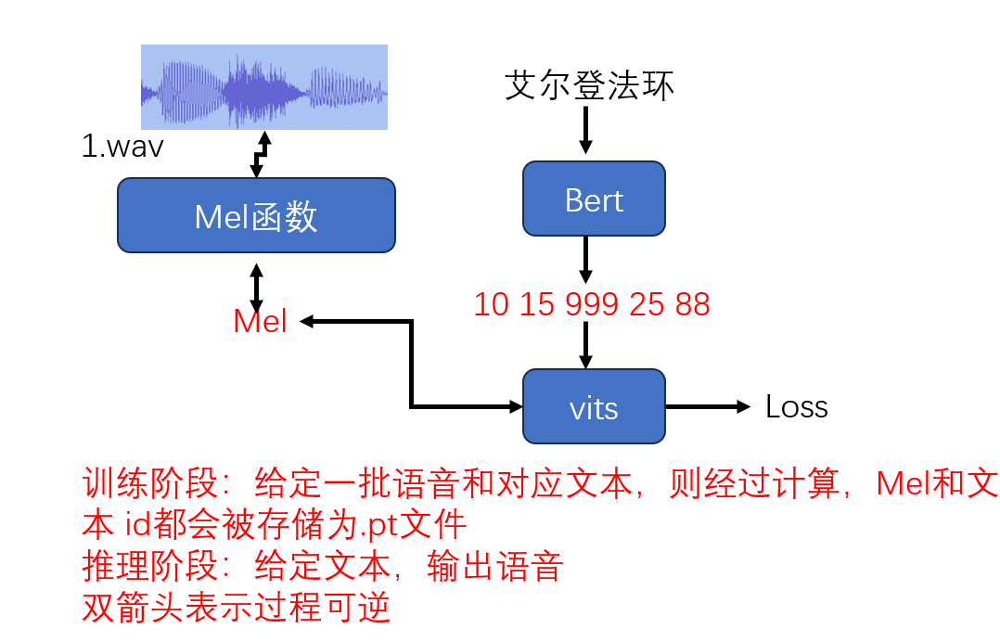

# 前言
原始项目:[Bert-VITS2]([https://github.com](https://github.com/fishaudio/Bert-VITS2)。
本文是一个改进版本的BERT VITS2项目使用教程，尽可能去除了bug。希望各位群策群力，提出issue，尽量减少bug，能快速开始微调。
有兴趣交流语音技术的同学可以加入QQ群 742922321。
Bert vits2语音合成项目已经停止维护，因此这最后一版本代码有必要分享一个部署经验。
Bert vits2项目的底模模型主要是bert +vits，训练数据主要是原神角色语音。微调训练的时候主要是微调vits模型，冻结bert模型。不包含任何speaker encoder和emotional encoder。
bert模型负责产生文本编码向量Ht。vits模型负责合成语音 wav = vits(Ht)。

该项目能进行语音合成推理和微调。需使用50条以上的1-5秒的语音进行微调。若用高质量语音数据，微调出来声音质量、推理速度、基本满足商业要求。

相比于gptsovits、fish-speech等新式TTS模型，有几个优势：1、由于模型小，因此合成速度快。做成接口以后，速度基本满足商业对话要求。2、经过微调后，音色稳定。
Fishspeech等模型，随机因素强，音色可能偏离，甚至发出没输入过的文本的声音。也有缺点：1、仅有3种语言。 2、代码存在诸多bug，需要自己修改。

本项目准备了文档：《第三版dhtz-2024年0912Bert-vits2项目部署经验.pdf》。该文档包含了项目如何修改完全BUG的过程。但仍然建议看下面的部署命令。

本人运行设备：ubuntu22.04系统，V100显卡2张。项目可以在windows运行，但是所有的路径需要改成win格式。

经过修改后的无bug版本和代码已经发布在123云盘，注意，已经包含所有模型和预训练文件，还包含一次微调过的模型文件。使用了AIshell3的SSB0005说话人。因此，你可以从这里下载所有模型，然后上传到你的服务器。
```
https://www.123pan.com/s/KLIzVv-pnMsh
提取码：wxkO
```

# 微调Demo演示
微调案例请访问：[Bert Vits Demo 演示 加载速度稍慢 请耐心等待](http://semanticexplore.com/bert_vits_demo)



# 一、conda 环境安装
```
# 推荐先安装torch torchaudio
conda create -n vits2 python=3.10.12
conda activate vits2
pip install torch torchaudio  -i https://pypi.tuna.tsinghua.edu.cn/simple
pip install -r requirements.txt  -i https://pypi.tuna.tsinghua.edu.cn/simple
```
```
## 为了在微调阶段免去标注的需求。我们额外使用了ASR（语音识别模型）来识别待微调语音。
## 因此需要安装python的sherpa onnx库。这是一个小米公司做的开源库。相当方便使用。
## 推荐的安装方式是使用.whl安装包安装。
 https://k2-fsa.github.io/sherpa/onnx/cuda.html
# 根据自己的操作系统和python版本进行选择。例如是linux系统，python虚拟环境是3.10的python版本，则下载：
sherpa_onnx-1.10.27+cuda-cp310-cp310-linux_x86_64.whl
# 随后将该文件上传到项目，执行：
pip install sherpa_onnx-1.10.27+cuda-cp310-cp310-linux_x86_64.whl
```

# 二、模型、数据准备
以微调一个 aishell3中文语音数据集的SSB0005说话人为案例。
需要准备bert模型、vits模型、WAVLM模型、SSB0005说话人的语音。
CN境内的服务器，建议利用hlf.sh下载。hlf.sh 的使用方式是：bash hlf.sh huggingface模型目录 你的服务器放置模型的路径

## 2.1 可以从huggingface复制模型目录
```
https://huggingface.co/hfl/chinese-roberta-wwm-ext-large
```
hfl/chinese-roberta-wwm-ext-large即为模型目录。其他模型的下载方式同理。
## 2.2 下载中文的BERT模型
```bash
bash hlf.sh  hfl/chinese-roberta-wwm-ext-large chinese-roberta-wwm-ext-large

# 移动到 bert文件夹下面
mv chinese-roberta-wwm-ext-large bert
```
其他语言的bert请参考：
```
"- [中文 RoBERTa](https://huggingface.co/hfl/chinese-roberta-wwm-ext-large)\n"
"- [日文 DeBERTa](https://huggingface.co/ku-nlp/deberta-v2-large-japanese-char-wwm)\n"
"- [英文 DeBERTa](https://huggingface.co/microsoft/deberta-v3-large)\n"
"- [WavLM](https://huggingface.co/microsoft/wavlm-base-plus)\n"
```
注意到，bert模型均放在文件夹./bert下面。
## 2.3 下载WAVLM模型
```bash
bash hlf.sh  microsoft/wavlm-base-plus wavlm-base-plus
# 移动到 slm文件夹下面
mv wavlm-base-plus slm

```
## 2.4 下载vits模型底模
建议下载下面网站的底模模型。然后自己上传到服务器对应目录下。
```
https://openi.pcl.ac.cn/Stardust_minus/Bert-VITS2/modelmanage/show_model
```
本项目采取《Bert-VITS2_2.3底模》。
将模型文件放在：
```
./A1_pretrained_models/Bert-VITS2_2.3
# 文件目录结构如下
A1_pretrained_models/Bert-VITS2_2.3
├── D_0.pth
├── DUR_0.pth
├── G_0.pth
├── README
└── WD_0.pth
```
# 二、Base model 推理
各种模型都放好的情况下，执行：
```
python A31_singleinfer.py
```
代码关键参数如下：
```python
## 一、 超参数加载。
    hps = get_hparams_from_file(config_path="configs/config.json") # 配置文件不能错
    device = "cuda:0"
    model_path = "A1_pretrained_models/Bert-VITS2_2.3/G_0.pth" ## 生成器的路径
    ## 
    speaker_name  = "八重神子_ZH"
    language = "ZH"
    length_scale = 1.2
    infer_text = "今夜的月光如此清亮，不做些什么真是浪费。随我一同去月下漫步吧，不许拒绝。"
    infer_id = 3 ## 当前合成了第infer_id个语音
    sdp_ratio=0.4
    output_path = f'A4_model_output/{speaker_name}_{infer_id}.wav'
```

# 三、使用自己准备的数据微调

## 3.1 准备高质量的语音文件
推荐准备44Khz的中文语音文件。数量建议大于50，每条的文本token数量建议大于5。（注意，若用低采样率的语音进行上采样基本无效。）
例如,将语音放入如下文件夹：
```
A2_prepared_audios/SSB0005
├── SSB00050001.wav
├── SSB00050002.wav
......
└── SSB00050490.wav
```
## 3.2 准备sherpaonnx库所需的ASR模型，VAD模型，PUNC模型，和环境
sherpa onnx库是由C语言写的底层代码，上层支持python、java等多种语言调用。
若希望使用GPU进行自动标注，在sherpa-onnx 1.10.27版本时，只能使用cudatookit 11.8版本。
但实际用CPU运行的速度也可以接受。
使用浏览器，新建三个任务，下载三个模型。分别是语音识别模型(ASR)，语音活动检测模型(VAD)，标点符号模型(PUNC)。
```
https://github.com/k2-fsa/sherpa-onnx/releases/download/asr-models/sherpa-onnx-paraformer-zh-2023-03-28.tar.bz2
https://github.com/k2-fsa/sherpa-onnx/releases/download/asr-models/silero_vad.onnx
https://github.com/k2-fsa/sherpa-onnx/releases/download/punctuation-models/sherpa-onnx-punct-ct-transformer-zh-en-vocab272727-2024-04-12.tar.bz2
```
将模型放置为：
```
A1_pretrained_models
├── Bert-VITS2_2.3
│   ├── D_0.pth
│   ├── DUR_0.pth
│   ├── G_0.pth
│   ├── README
│   └── WD_0.pth
├── sherpa-onnx-paraformer-zh-2023-03-28
│   ├── model.int8.onnx
│   ├── model.onnx
│   ├── README.md
│   ....
│   └── tokens.txt
├── sherpa-onnx-punct-ct-transformer-zh-en-vocab272727-2024-04-12
│   ├── add-model-metadata.py
│   ├── config.yaml
│   ├── model.onnx
│   ├── README.md
│   ├── show-model-input-output.py
│   ├── test.py
│   └── tokens.json
└── VAD_model
    └── silero_vad.onnx
```
如果你不具备cuda 11.8 的软件，则修改代码：
```
## A3_scripts/asr_model_list.py
def get_model02():
    recognizer = sherpa_onnx.OfflineRecognizer.from_paraformer(
            paraformer="A1模型文件/sherpa-onnx-paraformer-zh-2023-03-28/model.onnx",
            tokens="A1模型文件/sherpa-onnx-paraformer-zh-2023-03-28/tokens.txt",
            num_threads=1,
            sample_rate=16000,
            feature_dim=80,
            decoding_method="greedy_search",
            debug=False,
            provider='cpu' ### provider改成cpu。 
        )

```


## 3.3 识别准备好的语音文件的文本,形成文本、说话人、语音路径、语言的标注清单。
```bash
## 下面代码将对目录里的每条语音，进行标注。形成标注文件A5_finetuned_trainingout/SSB0005/filelists/script.txt。

    python A3_scripts/A33_ASR_ScriptsGen.py \
        --wavdir A2_prepared_audios/SSB0005\
        --output_txt A5_finetuned_trainingout/SSB0005/filelists/script.txt \
        --lang ZH
```
可以看到标注文件:
```
A2_prepared_audios/SSB0005/SSB00050001.wav|SSB0005|ZH|广州女大学生登山失联四天，警方找到疑似女尸。
......
``` 
## 3.4 G2P
G2P的目的是把文本序列转音素序列（产生.cleaned）,并划分训练验证集(产生.train和.val)。
因此，输入1个text路径，输出3个text的路径。顺便复制一下config文件。
```bash
cp configs/config.json A5_finetuned_trainingout/SSB0005

python preprocess_text.py \
    --transcription-path A5_finetuned_trainingout/SSB0005/filelists/script.txt \
    --cleaned-path A5_finetuned_trainingout/SSB0005/filelists/script.txt.cleaned \
    --train-path A5_finetuned_trainingout/SSB0005/filelists/script.txt.cleaned.train \
    --val-path A5_finetuned_trainingout/SSB0005/filelists/script.txt.cleaned.val \
    --config-path A5_finetuned_trainingout/SSB0005/config.json
```
顺便可以看到A5_finetuned_trainingout/SSB0005/config.json已经更新了：
```
 "data": {
    "training_files": "A5_finetuned_trainingout/SSB0005/filelists/script.txt.cleaned.train",
    "validation_files": "A5_finetuned_trainingout/SSB0005/filelists/script.txt.cleaned.val",
```
## 3.5 文本输入bert，生成token
生成的token存储为整数向量，存储为.pt文件
```bash
python bert_gen.py -c A5_finetuned_trainingout/SSB0005/config.json
```
## 3.6 语音生成melspec 
melspec用于辅助vits训练，每个语音都会产生一个，也存储为.pt文件。
先修改spec_gen.py文件
```
if __name__ == "__main__":
    ## 下面这个文件填入 script.txt.cleaned.train 的路径。也就是音素训练清单
    with open("A5_finetuned_trainingout/SSB0005/filelists/script.txt.cleaned.train", "r") as f:
        filepaths = [line.split("|")[0] for line in f]  # 取每一行的第一部分作为audiopath
```
再执行
```bash
python spec_gen.py
```
## 3.7 开始微调训练
建议是使用tmux窗口进行运行，可以后台运行。例如：
```
tmux new -s vits2
conda activate vits2
```
再执行
```
# 输入三个参数：新建的配置文件，微调输出目录，底模存放目录
# 该代码会自动复制底模文件 到 微调输出目录。 避免加载不到底模。
python train_ms.py -c A5_finetuned_trainingout/SSB0005/config.json \
-m A5_finetuned_trainingout/SSB0005 \
-mb A1_pretrained_models/Bert-VITS2_2.3
```
如果希望控制多卡机器，使用那张卡去训练，请加入环境变量控制。
下面的命令指定用显卡1，2进行双卡训练。
```bash
CUDA_VISIBLE_DEVICES=1,2  torchrun --nproc_per_node=2  train_ms.py -c A5_finetuned_trainingout/SSB0005/config.json \
-m A5_finetuned_trainingout/SSB0005 \
-mb A1_pretrained_models/Bert-VITS2_2.3
```

## 3.8 微调推理
在文件 A31_singleinfer.py 修改 config文件、生成器文件、speaker name即可
```
 ## 一、 超参数加载。
    hps = get_hparams_from_file(config_path="A5_finetuned_trainingout/SSB0005/config.json")
    device = "cuda:0"
    model_path = "A5_finetuned_trainingout/SSB0005/models/G_1000.pth"
    ## 
    speaker_name  = "SSB0005"
    language = "ZH"
```

# 四、fastapi部署服务
注意修改模型初始化代码，然后启动服务器程序。
```
# 加载模型
def load_model():
    global model, hps
    if model is None and hps is None:
        hps = get_hparams_from_file(config_path="configs/config.json")  ## 注意填写这两项
        model_path = "A1_pretrained_models/Bert-VITS2_2.3/G_0.pth"  ## 注意填写这两项
```
```bash
python A35_inference_server.py
```
请求程序:
```bash
python A36_post.py
## 注意post的时候，写对下面的各项内容。 要和自己训练的模型对应。
request_data = {
    "speaker_name": "八重神子_ZH",
    "language": "ZH",
    "length_scale": 1.2,
    "infer_text": "即使引导已经破碎，也请觐见艾尔登法环",
    "infer_id": 4,
    "sdp_ratio": 0.4,
    
}
## 这里用 infer_id 这个变量控制输出语音的路径。 id是index的意思。而不是identity。 
a  = request_data["infer_id"]
request_data["output_path"] =  f"A4_model_output/SSB0005_{a}.wav" ## 注意这里的输出目录。得存在。
```

## 4.1 接口的推理速度：
推理产生3.4秒的音频，文本长度为18，平均用了0.15秒
```
{'output_path': 'A4_model_output/SSB0005_4.wav', 'out_info1': '{audiolen:3.4946,textlen:18.0000,usetime:0.1406}'}
```

# 五、额外工具
## 5.1 可以删除大于一定步数的模型：
```bash
python A3_scripts/A34_deleteModels.py
```
## 5.2 利用VAD模型自动切割语音
请参考下面2个文件。使用方法不再赘述
```
A37-ffmpeg.py
A38-VAD_batch.py
```

## 5.3 可以一键启动全部流程.只需放好 A2_prepared_audios/gentle_girl 数据
```bash
A40_一键启动微调pipeline.sh
```

## 感谢所有贡献者作出的努力
GitYesm
